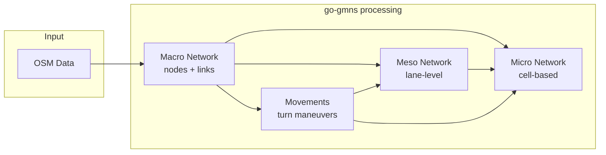

# GMNS - General Modeling Network Specification

## About
Go implementation of basic data in GMNS (General Modeling Network Specification). Contains data structures and generators utils for multi-resolution transportation networks.

This package provides:
- Data structures for macroscopic, mesoscopic, and microscopic networks
- Generators for meso and micro networks from macro networks
- Movement generation at intersections/junctions
- GeoJSON export for debugging and visualization

This package has been created for [osm2gmns](https://github.com/LdDl/osm2gmns) mostly, but can be used independently.

## Architecture

### Generation Pipeline



### Network Resolution Levels

| Level | Description | Typical Use Case |
|-------|-------------|------------------|
| **Macro** | Road segments between intersections/road topology changes. Single centerline geometry shared by both directions. Nodes = intersections, lane additions/drops | Route planning, traffic assignment |
| **Meso** | One link per direction with offset geometry. Stores lane count attribute. Splits where lane count changes | Signal optimization, lane-based routing |
| **Micro** | Per-lane, per-cell representation. Each meso link expanded to N lanes × M cells. Inter-lane links for lane changing after each cell | Microsimulation, car-following models |

### Data Flow Example

```
Bidirectional road A<===>B, 2 lanes per direction:

MACRO (centerline geometry, shared by both directions):
    (A) ==========[Link 1]==========> (B)
    (A) <==========[Link 2]========== (B)

MESO (offset geometry, one link per direction, lanes=2):
    Direction A→B:  (X)----[Link 1]---->(Y)
    Direction B→A:  (Z)----[Link 2]---->(K)

MICRO (per-lane cells + lane-change links):
    For meso Link 1 (lanes=2):

    Lane 1: o-F---o-F---o-F---o-F---o  cell_type=forward
             \   L \   L \   L \   L   cell_type=lane_change (left)
              \ /   \ /   \ /   \ /
              / \   / \   / \   / \    cell_type=lane_change (right)
             /   R /   R /   R /   R
    Lane 2: o-F---o-F---o-F---o-F---o  cell_type=forward
```

Scale (typical):
| Level | Nodes | Links | Ratio |
|-------|-------|-------|-------|
| Macro | 20 | 38 | 1x |
| Meso | 76 | 110 | ~3x |
| Micro | 3078 | 4022 | ~100x |

## Installation

```bash
go get github.com/LdDl/go-gmns
```

## Current state

### Network levels

- [x] **Macroscopic network** (`macro/`)
    - [x] Links with lane information
    - [x] Nodes with control/boundary types
    - [x] Network container
    - [x] GeoJSON export

- [x] **Movements** a.k.a. allowed maneuvers at junctions (`movement/`)
    - [x] Movement types (THRU, LEFT, RIGHT, UTURN)
    - [x] Composite movement classification
    - [x] Geometry utilities
    - [x] GeoJSON export

- [x] **Mesoscopic network** (`meso/`)
    - [x] Lane-level links
    - [x] Lane-level nodes
    - [x] Network container
    - [x] GeoJSON export

- [x] **Microscopic network** (`micro/`)
    - [x] Cell-based links (forward, lane-change)
    - [x] Cell vertex nodes
    - [x] Network container
    - [x] GeoJSON export

### Generators (`generators/`)

- [x] **Movements** - turn movements at intersections
- [x] **Mesoscopic data** - expands macro network to lane-level
- [x] **Microscopic data** - cell-based decomposition of meso network

### Basic stuff

- [x] **Types** (`gmns/types/`)
    - [x] LinkType, LinkClass, LinkConnectionType
    - [x] ControlType, BoundaryType
    - [x] AgentType (auto, bike, walk, etc.)
    - [x] CellType (forward, lane_change)
    - [x] ActivityType, AccessType
    - [x] NetworkType, HighwayType

- [x] **Utils** (`utils/geomath/`)
    - [x] Coordinate transformations (WGS84/Euclidean)
    - [x] Line offset calculations
    - [x] Distance calculations

### further work:

- [ ] Traffic signal timing
- [ ] Extended test coverage
- [ ] Performance benchmarks

## Data dictionary

Most of it gracefully stolen from https://osm2gmns.readthedocs.io/en/stable/mrm.html

### Macroscopic network

The macroscopic network represents road segments at the highest level of abstraction, where each link connects two nodes (intersections or points where road topology changes).

#### Macro nodes

| Field | Type | Description |
|-------|------|-------------|
| `id` | int64 | Unique node identifier |
| `osm_node_id` | int64 | Original OpenStreetMap node ID |
| `control_type` | string | Traffic control type at node: `none`, `yield`, `stop`, `signal`, `signal_minor_stop`, `signal_minor_yield` |
| `boundary_type` | string | Boundary classification: `none`, `income_only`, `outcome_only`, `income_outcome` |
| `activity_type` | string | Activity type: `none`, `poi`, `link` |
| `activity_link_type` | string | If activity_type=link, the predominant link type at this node |
| `zone_id` | int64 | Zone identifier for boundary nodes (-1 if not applicable) |
| `intersection_id` | int64 | Intersection cluster ID (-1 if not applicable) |
| `poi_id` | int64 | Point of interest ID (-1 if not applicable) |
| `osm_highway` | string | OSM highway tag value (e.g., `traffic_signals`, `crossing`) |
| `name` | string | Node name from OSM data |
| `longitude` | float64 | WGS84 longitude coordinate |
| `latitude` | float64 | WGS84 latitude coordinate |

#### Macro links

| Field | Type | Description |
|-------|------|-------------|
| `id` | int64 | Unique link identifier |
| `source_node` | int64 | Source node ID |
| `target_node` | int64 | Target node ID |
| `osm_way_id` | int64 | Original OpenStreetMap way ID |
| `source_osm_node_id` | int64 | Source OSM node ID |
| `target_osm_node_id` | int64 | Target OSM node ID |
| `link_class` | string | Road class: `highway`, `railway`, `aeroway` |
| `is_link` | string | Connection type: `no`, `yes`, `merge`, `diverge` |
| `link_type` | string | Road type: `motorway`, `trunk`, `primary`, `secondary`, `tertiary`, `residential`, `service`, `connector`, `cycleway`, `footway`, `track`, `undefined` |
| `control_type` | string | Traffic control at downstream end |
| `allowed_agent_types` | string | Comma-separated list of allowed agents: `auto`, `bike`, `walk`, `transit`, `rail`, `truck` |
| `was_bidirectional` | bool | Whether original OSM way was bidirectional |
| `lanes` | int | Number of lanes in this direction |
| `max_speed` | float64 | Maximum speed limit (km/h) |
| `free_speed` | float64 | Free-flow speed (km/h) |
| `capacity` | int | Capacity (vehicles/hour) |
| `length_meters` | float64 | Link length in meters |
| `name` | string | Road name from OSM |
| `geom` | WKT | LineString geometry in WKT format |

### Movements

Movements represent allowed turn maneuvers at intersections, connecting incoming links to outgoing links.

#### Movement fields

| Field | Type | Description |
|-------|------|-------------|
| `id` | int64 | Unique movement identifier |
| `node_id` | int64 | Macro node ID where movement occurs |
| `osm_node_id` | int64 | OSM node ID of the intersection |
| `name` | string | Movement name (typically empty) |
| `in_link_id` | int64 | Incoming macro link ID |
| `in_lane_start` | int | Starting lane index on incoming link |
| `in_lane_end` | int | Ending lane index on incoming link |
| `out_link_id` | int64 | Outgoing macro link ID |
| `out_lane_start` | int | Starting lane index on outgoing link |
| `out_lane_end` | int | Ending lane index on outgoing link |
| `lanes_num` | int | Number of lanes for this movement |
| `from_osm_node_id` | int64 | Source OSM node of incoming link |
| `to_osm_node_id` | int64 | Target OSM node of outgoing link |
| `type` | string | Movement direction: `thru`, `left`, `right`, `uturn` |
| `penalty` | int | Turn penalty (-1 if not set) |
| `capacity` | int | Movement capacity (-1 if not set) |
| `control_type` | string | Traffic control type |
| `movement_composite_type` | string | Composite type code (see table below) |
| `volume` | int | Traffic volume (-1 if not set) |
| `free_speed` | int | Free-flow speed (-1 if not set) |
| `allowed_agent_types` | string | Comma-separated allowed agents |
| `geom` | WKT | LineString geometry connecting link endpoints |

#### Movement composite types

The composite type combines incoming direction, outgoing direction, and turn direction:

| Code | From | Turn | Description |
|------|------|------|-------------|
| `EBT` | East | Thru | Eastbound through |
| `EBL` | East | Left | Eastbound left turn |
| `EBR` | East | Right | Eastbound right turn |
| `EBU` | East | U-turn | Eastbound U-turn |
| `WBT` | West | Thru | Westbound through |
| `WBL` | West | Left | Westbound left turn |
| `WBR` | West | Right | Westbound right turn |
| `WBU` | West | U-turn | Westbound U-turn |
| `NBT` | North | Thru | Northbound through |
| `NBL` | North | Left | Northbound left turn |
| `NBR` | North | Right | Northbound right turn |
| `NBU` | North | U-turn | Northbound U-turn |
| `SBT` | South | Thru | Southbound through |
| `SBL` | South | Left | Southbound left turn |
| `SBR` | South | Right | Southbound right turn |
| `SBU` | South | U-turn | Southbound U-turn |

### Mesoscopic network

The mesoscopic network provides lane-level representation with offset geometries for each direction.

#### Meso nodes

| Field | Type | Description |
|-------|------|-------------|
| `id` | int64 | Unique meso node identifier |
| `macro_node_id` | int64 | Associated macro node ID (-1 if none) |
| `macro_link_id` | int64 | Associated macro link ID for mid-link nodes (-1 if at intersection) |
| `macro_zone_id` | int64 | Zone ID from macro network (-1 if not boundary) |
| `activity_link_type` | string | Link type for activity nodes |
| `boundary_type` | string | Boundary type: `none`, `income_only`, `outcome_only`, `income_outcome` |
| `longitude` | float64 | WGS84 longitude |
| `latitude` | float64 | WGS84 latitude |

#### Meso links

| Field | Type | Description |
|-------|------|-------------|
| `id` | int64 | Unique meso link identifier |
| `source_node` | int64 | Source meso node ID |
| `target_node` | int64 | Target meso node ID |
| `macro_node_id` | int64 | Associated macro node (-1 for road segments) |
| `macro_link_id` | int64 | Associated macro link ID |
| `segment_idx` | int | Segment index within macro link |
| `is_connection` | bool | Whether this is a connector link at intersection |
| `movement_id` | int64 | Movement ID for connector links (-1 otherwise) |
| `movement_composite_type` | string | Movement type code for connectors |
| `in_lane_start` | int | Incoming lane start index |
| `in_lane_end` | int | Incoming lane end index |
| `out_lane_start` | int | Outgoing lane start index |
| `out_lane_end` | int | Outgoing lane end index |
| `control_type` | string | Traffic control type |
| `link_type` | string | Road type from macro link |
| `lanes_num` | int | Number of lanes |
| `lanes_change` | int | Lane change indicator: -1 (decrease), 0 (same), +1 (increase) |
| `free_speed` | float64 | Free-flow speed (km/h) |
| `capacity` | int | Capacity (vehicles/hour) |
| `allowed_agent_types` | string | Comma-separated allowed agents |
| `length_meters` | float64 | Link length in meters |
| `geom` | WKT | Offset LineString geometry |

### Microscopic network

The microscopic network provides cell-based representation for detailed simulation, decomposing each meso link into per-lane cells with lane-change connections.

#### Micro nodes

| Field | Type | Description |
|-------|------|-------------|
| `id` | int64 | Unique micro node identifier |
| `meso_link_id` | int64 | Associated meso link ID |
| `lane_id` | int | Lane index within the meso link |
| `cell_index` | int | Cell position along the lane (0 = upstream) |
| `is_upstream_end` | bool | Whether node is at upstream end of meso link |
| `is_downstream_end` | bool | Whether node is at downstream end of meso link |
| `zone_id` | int64 | Zone ID for boundary nodes (-1 otherwise) |
| `boundary_type` | string | Boundary type: `none`, `income_only`, `outcome_only`, `income_outcome` |
| `longitude` | float64 | WGS84 longitude |
| `latitude` | float64 | WGS84 latitude |

#### Micro links

| Field | Type | Description |
|-------|------|-------------|
| `id` | int64 | Unique micro link identifier |
| `source_node` | int64 | Source micro node ID |
| `target_node` | int64 | Target micro node ID |
| `meso_link_id` | int64 | Associated meso link ID |
| `macro_link_id` | int64 | Associated macro link ID |
| `macro_node_id` | int64 | Associated macro node (-1 for road cells) |
| `cell_type` | string | Cell type: `forward`, `lane_change_left`, `lane_change_right` |
| `lane_id` | int | Lane index (for forward cells) |
| `is_first_movement_cell` | bool | Whether this is first cell of a movement |
| `movement_composite_type` | string | Movement type for connection cells |
| `additional_travel_cost` | float64 | Extra cost for lane changes |
| `meso_link_type` | string | Link type from meso network |
| `control_type` | string | Traffic control type |
| `allowed_agent_types` | string | Comma-separated allowed agents |
| `free_speed` | float64 | Free-flow speed (km/h) |
| `capacity` | int | Capacity (vehicles/hour) |
| `length_meters` | float64 | Cell length in meters |
| `geom` | WKT | LineString geometry |

## Generation process

### Step 1: Macro network

The macro network is constructed from OpenStreetMap data:
1. Ways are split at crossing nodes (intersections, road topology changes)
2. Bidirectional ways generate two links (one per direction), but share geometry
3. Boundary types are determined based on connectivity
4. Activity types are assigned based on connected link types

This piece of whole pipeline is not implemented here, but in [osm2gmns](https://github.com/LdDl/osm2gmns) tool.

### Step 2: Movement generation

Movements are generated at each macro node:
1. For **merge nodes** (one outgoing link): Connects all incoming links to the single outgoing link
2. For **diverge nodes** and **intersections** (multiple outgoing links): Creates movements from each incoming link to each compatible outgoing link
3. Lane mapping determines which lanes connect through each movement
4. Movement direction (thru/left/right/uturn) is computed from geometry angles

### Step 3: Meso network

The meso network expands macro network to lane-level:
1. Each macro link generates meso segments between lane-change points
2. Meso nodes are created at intersections and mid-link lane transitions
3. **Connection links** are added at intersections based on movements
4. Offset geometry is computed for each direction

### Step 4: Micro network

The micro network decomposes meso links into cells:
1. Each meso link is divided into cells of configurable length (default ~7m)
2. Each lane gets its own row of cells
3. **Forward links** connect cells along the same lane
4. **Lane-change links** connect adjacent lanes at each cell boundary
5. Movement cells inherit the movement's composite type

## Usage Example

The best thing to get idea is to explore this tool: https://github.com/LdDl/osm2gmns.

## References
Lu, J., & Zhou, X.S. (2023). Virtual track networks: A hierarchical modeling framework and open-source tools for simplified and efficient connected and automated mobility (CAM) system design based on general modeling network specification (GMNS). Transportation Research Part C: Emerging Technologies, 153, 104223. [paper link](https://linkinghub.elsevier.com/retrieve/pii/S0968090X23002127)
