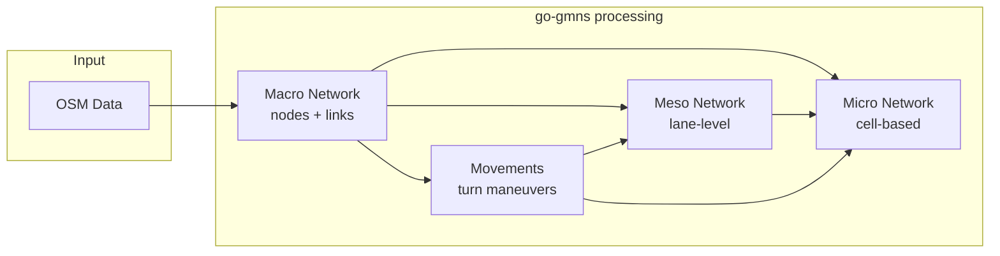

# GMNS - General Modeling Network Specification

## About
Go implementation of basic data in GMNS (General Modeling Network Specification). Contains data structures and generators utils for multi-resolution transportation networks.

This package provides:
- Data structures for macroscopic, mesoscopic, and microscopic networks
- Generators for meso and micro networks from macro networks
- Movement generation at intersections/junctions
- GeoJSON export for debugging and visualization

This package has been created for [osm2gmns](https://github.com/LdDl/osm2gmns) mostly, but can be used independently.

## Architecture

### Generation Pipeline



### Network Resolution Levels

| Level | Description | Typical Use Case |
|-------|-------------|------------------|
| **Macro** | Road segments between intersections/lane topology changes. Single centerline geometry shared by both directions. Nodes = intersections, lane additions/drops | Route planning, traffic assignment |
| **Meso** | One link per direction with offset geometry. Stores lane count attribute. Splits where lane count changes | Signal optimization, lane-based routing |
| **Micro** | Per-lane, per-cell representation. Each meso link expanded to N lanes × M cells. Inter-lane links for lane changing after each cell | Microsimulation, car-following models |

### Data Flow Example

```
Bidirectional road A<===>B, 2 lanes per direction:

MACRO (centerline geometry, shared by both directions):
    (A) ==========[Link 1]==========> (B)
    (A) <==========[Link 2]========== (B)

MESO (offset geometry, one link per direction, lanes=2):
    Direction A→B:  (X)----[Link 1]---->(Y)
    Direction B→A:  (Z)----[Link 2]---->(K)

MICRO (per-lane cells + lane-change links):
    For meso Link 1 (lanes=2):

    Lane 1: o-F---o-F---o-F---o-F---o  cell_type=forward
             \   L \   L \   L \   L   cell_type=lane_change (left)
              \ /   \ /   \ /   \ /
              / \   / \   / \   / \    cell_type=lane_change (right)
             /   R /   R /   R /   R
    Lane 2: o-F---o-F---o-F---o-F---o  cell_type=forward
```

Scale (typical):
| Level | Nodes | Links | Ratio |
|-------|-------|-------|-------|
| Macro | 20 | 38 | 1x |
| Meso | 76 | 110 | ~3x |
| Micro | 3078 | 4022 | ~100x |

## Installation

```bash
go get github.com/LdDl/go-gmns
```

## Current state

### Network levels

- [x] **Macroscopic network** (`macro/`)
    - [x] Links with lane information
    - [x] Nodes with control/boundary types
    - [x] Network container
    - [x] GeoJSON export

- [x] **Movements** a.k.a. allowed maneuvers at junctions (`movement/`)
    - [x] Movement types (THRU, LEFT, RIGHT, UTURN)
    - [x] Composite movement classification
    - [x] Geometry utilities
    - [x] GeoJSON export

- [x] **Mesoscopic network** (`meso/`)
    - [x] Lane-level links
    - [x] Lane-level nodes
    - [x] Network container
    - [x] GeoJSON export

- [x] **Microscopic network** (`micro/`)
    - [x] Cell-based links (forward, lane-change)
    - [x] Cell vertex nodes
    - [x] Network container
    - [x] GeoJSON export

### Generators (`generators/`)

- [x] **Movements** - turn movements at intersections
- [x] **Mesoscopic data** - expands macro network to lane-level
- [x] **Microscopic data** - cell-based decomposition of meso network

### Basic stuff

- [x] **Types** (`gmns/types/`)
    - [x] LinkType, LinkClass, LinkConnectionType
    - [x] ControlType, BoundaryType
    - [x] AgentType (auto, bike, walk, etc.)
    - [x] CellType (forward, lane_change)
    - [x] ActivityType, AccessType
    - [x] NetworkType, HighwayType

- [x] **Utils** (`utils/geomath/`)
    - [x] Coordinate transformations (WGS84/Euclidean)
    - [x] Line offset calculations
    - [x] Distance calculations

### further work:

- [ ] Traffic signal timing
- [ ] Extended test coverage
- [ ] Performance benchmarks

## Usage Example

The best thing to get idea is to explore this tool: https://github.com/LdDl/osm2gmns.

## References
Lu, J., & Zhou, X.S. (2023). Virtual track networks: A hierarchical modeling framework and open-source tools for simplified and efficient connected and automated mobility (CAM) system design based on general modeling network specification (GMNS). Transportation Research Part C: Emerging Technologies, 153, 104223. [paper link](https://linkinghub.elsevier.com/retrieve/pii/S0968090X23002127)
